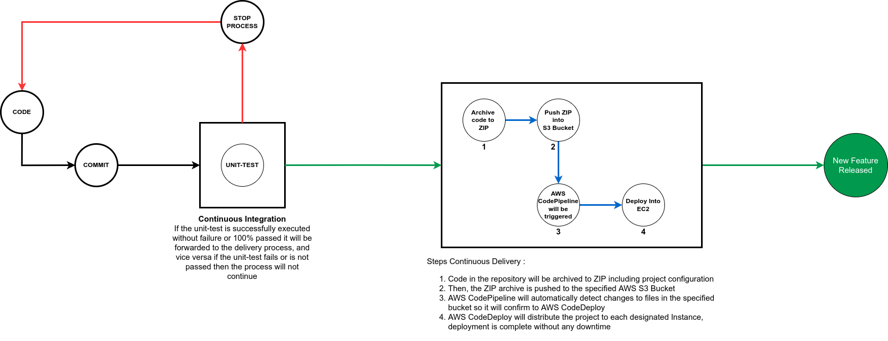

# ZOT Skill Test

## Bonus Problem 1

## Bonus Problem 2 
Create a CI task to run unit-tests and a CD task for deployment services. In this case I'll be using Gitlab CI as the tool to run the job so I'm just attaching one `.gitlab-ci.yml` file as the job configuration. Before trying this configuration, first prepare some CI/CD Variables:

`AWS_S3_OBJECT_NAME` = name of the ZIP file to be created
`AWS_S3_BUCKET_TARGET` = URI S3 of the target bucket to be pushed.

I created this job with a sample Laravel project, which previously had to prepare a docker image with tag `registry.gitlab.com/<USERNAME>/laravel-project:latest` for use in this job.

Below is the flow of the CI/CD work process that I made
